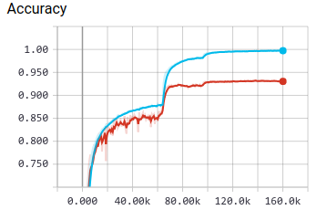
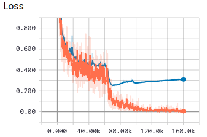
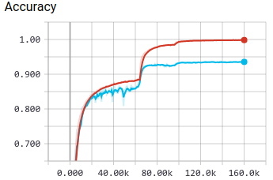
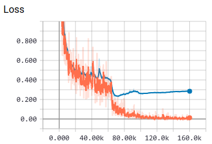

# ReImplementation of Residual Attention Network for Image Classification
This is a Gluon implementation of the residual attention network in the paper [1704.06904](https://arxiv.org/abs/1704.06904).

## Requirement
python3.5, mxnet-1.2.1+, MXBoard

## Inspiration
The code is inspired by the gluon resnet implementation and https://github.com/liudaizong/Residual-Attention-Network.

## Train
### Cifar10
**Download Dataset**

```shell
wget http://www.cs.toronto.edu/~kriz/cifar-10-python.tar.gz
```

**Training**   

```shell
python3 train.py --data-root /path/to/cifar-10/data --batch-size 128 --epochs 200 --lr-steps 80,120
```

To view the training process, tensorboard is required.
 
```shell
tensorboard --logdir=./log/board/cifar10_201808311834 --host=0.0.0.0 --port=8888
```

|Results|Accuracy|Loss |Val Accuracy|
|:---:  |:---:   |:---:|:---:       |
|Attention56|||0.9310|
|Attention92|||0.9360|

## TODO
- [x] train scripts
- [ ] attention module with other basic network unit  
...

## References
1. Residual Attention Network for Image Classification [1704.06904](https://arxiv.org/abs/1704.06904)
1. MXNet Documentation and Tutorials [zh.gluon.ai/](http://zh.gluon.ai/)