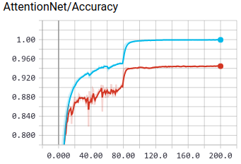
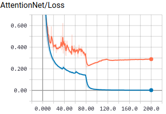
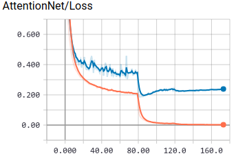

# ReImplementation of Residual Attention Network for Image Classification
This is a Gluon implementation of the residual attention network in the paper [1704.06904](https://arxiv.org/abs/1704.06904).


## Requirement
python3.5+, mxnet-1.2.1+, MXBoard

## Inspiration
The code is inspired by the gluon resnet implementation and https://github.com/liudaizong/Residual-Attention-Network.

Mixup data augmentation use GluonCV for reference.     

## Train
GPU is preferred.
### Cifar10
To view the training process, tensorboard is required.
 
```shell
tensorboard --logdir=./log/board/cifar10_201808311834 --host=0.0.0.0 --port=8888
```

|Results|Accuracy|Loss |Test Accuracy|Test Accuracy(using mixup)|Official Report|
|:---:  |:---:   |:---:|:---:        |:---:                     |:---:          |
|Attention56|||0.9499|0.9581|0.9448|
|Attention92|||0.9524|0.9608|0.9501|
   
The author does not give the architecture of cifar10-AttentionNet, 
I follow the implementation of https://github.com/tengshaofeng/ResidualAttentionNetwork-pytorch.  
In previous version, the feature map is down sampled to 16x16 before stage1, it can only achieve about 0.93 on test set. 
Following Teng's implementation, the feature map size is still 32x32, and it gets an accuracy improvement of 2%.

**Tricks**  
I followed the tricks in [1812.01187](https://arxiv.org/abs/1812.01187), 
the pipeline is training res-att-net56 on 8 1080ti GPUs with nvidia-dali and BytePS, 
which allow to finish in 1 hour for cifar10.

|Layers|batch_size|lr|warmup|mix_up|alpha|epsilon|max_accuracy|
|:---|:---|:---|:---|:---|:---|:---|:---|
|56| 128|2.0|5|False|0.2|-|0.956631 |
|56| 128|1.5|5|False|0.2|-|0.955929 |
|56| 128|1.0|5|False|0.2|-|0.954527 |
|56| 128|2.0|5|True|0.2|-|0.959135 |
|56| 128|2.0|5|True|0.4|-|0.962240 |
|56| 128|2.0|5|True|1.0|-|**0.962941** |
|56| 128|2.0|5|True|0.2|0.1|0.961839 |
|56| 128|2.0|5|True|0.2|0.01|0.961038 |
|56| 128|2.0|10|True|0.2|0.1|0.959635 |
|56| 128|2.0|10|True|1.0|0.1|**0.963742** |
|56| 128|1.6|10|True|1.0|0.0|**0.965044** |
|56| 128|2.0|10|True|0.2|0.01|0.959235 |
|56| 64|2.0|5|False|0.2|-|0.955729 |
|56| 64|1.5|5|False|0.2|-|0.956831 |
|56| 64|1.0|5|False|0.2|-|0.955812 |
|56| 64|2.0|10|True|0.2|0.1|0.958534 |
|56| 64|2.0|10|True|1.0|0.1|0.957833 |
|56| 64|2.0|10|True|0.2|0.01|0.955829 |
|56| 64|1.0|5|True|0.4|-|0.962182 |
|56| 64|1.0|5|True|1.0|-|**0.964670** |
|56| 64|1.0|5|True|1.0|0.1|0.963642 |
|56| 64|1.0|5|True|1.0|0.01|0.963674 |
|56| 64|1.0|10|True|1.0|0.1|0.962139 |
|56| 64|0.8|10|True|1.0|0.1|**0.964271** |
|56| 64|0.4|10|True|1.0|0.1|0.963442 |

Note:
- `alpha` control how we generate the mix up data and label.
- `epsilon` is related to label smoothing.

The code will be released when I finish all the experiments.

### ImageNet
Emmmm....

## TODO
- [x] Training scripts for cifar10.  
Just use this command and you can get accuracy over 0.95 on cifar10:  
```shell
python3 cifar10_train.py --num-layers 92 --num-gpus 1 --workers 2 --batch-size 64 --epochs 200 --lr-steps 80,120 --mix-up 1 --alpha 1.0
```
It can be easily applied to other tasks.

- [x] Attention-56,92,128,164,236,452 support  
The hyper-parameters are based on paper section 4.1. The number of layers can be calculated by 36m+20 
where m is the number of Attention Module in each stage when `p, t, r = 1, 2, 1`.
```python
attention_net_spec = {56: ([1, 2, 1], [1, 1, 1]),
                      92: ([1, 2, 1], [1, 2, 3]),
                      128: ([1, 2, 1], [3, 3, 3]),
                      164: ([1, 2, 1], [4, 4, 4]),
                      236: ([1, 2, 1], [6, 6, 6]),
                      452: ([2, 4, 3], [6, 6, 6])}
``` 
- [ ] ~~Visualization of soft attention mask~~
- [ ] ~~Attention module with other basic network unit~~  
...

## References
1. Residual Attention Network for Image Classification [1704.06904](https://arxiv.org/abs/1704.06904)
1. MXNet Documentation and Tutorials [zh.gluon.ai/](http://zh.gluon.ai/)
1. GluonCV Classification [gluon-cv.mxnet.io/model_zoo/classification.html](https://gluon-cv.mxnet.io/model_zoo/classification.html)